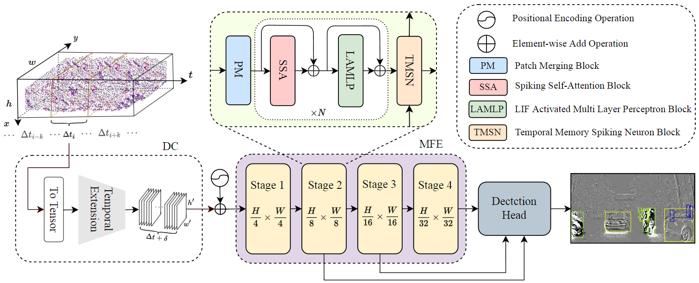
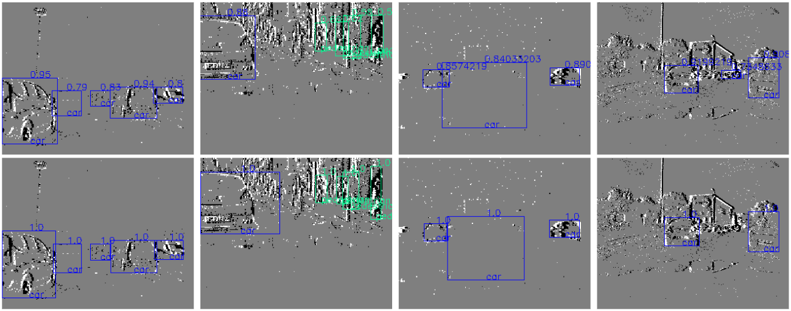
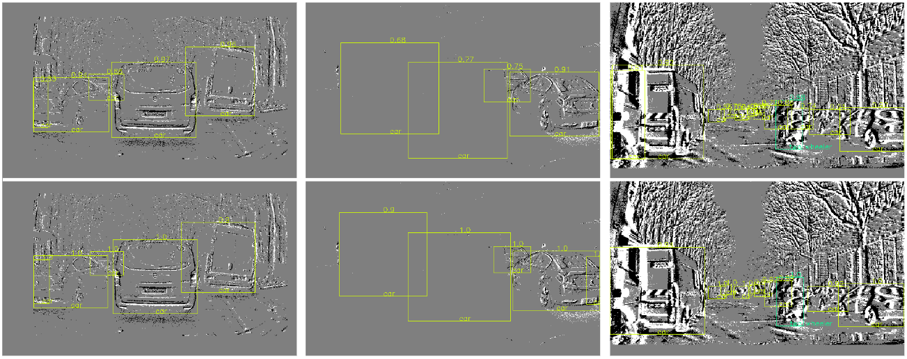

# SpikingViT
The implementation of spikingVit for object detection on event-based datasets.





## Conda Installation
```bash
conda create -n spikingVit python=3.10
conda activate spikingVit

pip install -r requirements.txt
```

## Runing scripts
We highly recommend running our code on the **Linux** platform, as there are some errors related to the multiprocessing package on the **Windows** platform.
```bash
sudo chmod +x ./train_gen1/4.sh
./train_gen1/4.sh
```

## Validataion scripts
```bash
sudo chmod +x ./val_gen1/4.sh
./val_gen1/4.sh
```

## Citation
If you find our work helpful for your research, please consider citing the following BibTeX entry.
```Tex
@ARTICLE{10586833,
  author={Yu, Lixing and Chen, Hanqi and Wang, Ziming and Zhan, Shaojie and Shao, Jiankun and Liu, Qingjie and Xu, Shu},
  journal={IEEE Transactions on Cognitive and Developmental Systems}, 
  title={SpikingViT: a Multi-scale Spiking Vision Transformer Model for Event-based Object Detection}, 
  year={2024},
  volume={},
  number={},
  pages={1-17},
  keywords={Object detection;Transformers;Cameras;Feature extraction;Data mining;Voltage control;Task analysis;Object Detection;DVS Data Converting;Spiking Transformer;Residual Voltage Memory},
  doi={10.1109/TCDS.2024.3422873}}
```
And don't forget to cite our acknowledgment project.

## Code Acknowledgments
This project has used code from the following projects:
- [RVT](https://github.com/uzh-rpg/RVT) for their most of code and dataset preprocessing.
- [spikformer](https://github.com/ZK-Zhou/spikformer) for their high-performance SSA module, which has significantly improved our project.
- [YOLOX](https://github.com/Megvii-BaseDetection/YOLOX) for their high-performance detection model, which has significantly improved our project.
